#  Day 1: Introduction to Verilog RTL Design & Synthesis

I'm diving into digital design and exploring Verilog, a hardware description language. This day's focus is on understanding the basics of Verilog, simulation with  **Icarus Verilog (iverilog)**, and logic synthesis using **Yosys**.
---

##  Table of Contents

1. [What is a Simulator, Design, and Testbench?](#1-what-is-a-simulator-design-and-testbench)
2. [iverilog Simulation Flow](#2-iverilog-Simulation-Flow)
3. [What is a VCD File](#3-what-is-a-vcd-file)
4. [Lab: Simulating a 2-to-1 Multiplexer](#4-lab-simulating-a-2-to-1-multiplexer)
5. [Verilog Code Analysis](#4-verilog-code-analysis)
6. [Yosys & Gate Libraries](#6-introduction-to-yosys--gate-libraries)
7. [Synthesis Lab with Yosys](#7-synthesis-lab-with-yosys)
8. [Summary](#8-summary)

---

## 1. What is a Simulator, Design, and Testbench?

###  Simulator

A **simulator** is a software tool that runs our digital circuit virtually. It takes our Verilog design and a testbench as input to check if the circuit works correctly before it's ever built. This saves significant time and cost by helping you find bugs early in the design process.

###  Design

The **design** is the core of our project. It's the Verilog code that describes the actual logic of the circuit you want to create. This could be anything from a simple counter to a complex processor. It’s what you're ultimately building and what the testbench is meant to verify.

###  Testbench

A **testbench** is the verification environment for our design. It's a separate Verilog file that doesn't get turned into hardware. Its purpose is to feed specific inputs to our design and check if the outputs are correct, acting like a lab where we can test our circuit and ensure it behaves as expected.

<div align="center">
  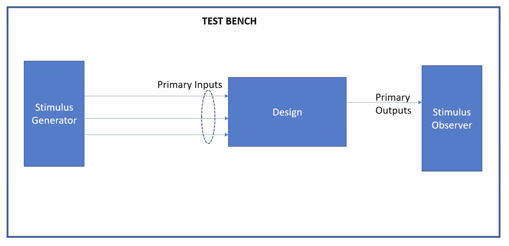
</div>

---

## 2. iverilog Simulation Flow

**iverilog** is an open-source simulator for Verilog. Here’s the typical simulation flow:

<div align="center">
  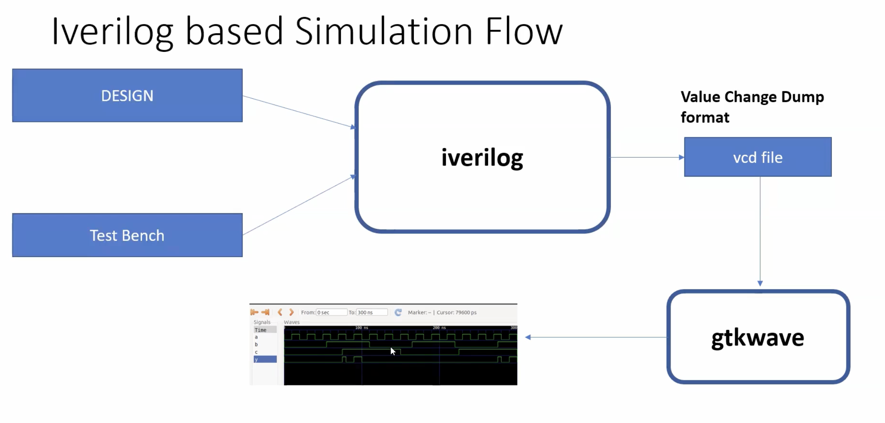
</div>

- Inputs: The process starts with two Verilog files: the **Design** and the **Test Bench**.

The Design is the Verilog code for the digital circuit you want to test.

The Test Bench is a separate Verilog file that applies specific input signals to your design and checks for correct outputs. It acts as the testing environment.

- The simulator produces a `.vcd` file for waveform viewing in GTKWave.

---
## 3. What is a VCD File

A **VCD (Value Change Dump)** file is a text-based file that records the activity of a digital circuit during a simulation. It is essentially a log of every time a signal's value changes, along with the specific timestamp of that change.

This file format is widely used in the field of digital design because it provides a compact and standardized way to capture all the necessary information for a waveform viewer (like **GTKWave**) to display the simulation results graphically for analysis and debugging.

---
## 4. Lab: Simulating a 2-to-1 Multiplexer

Simulating a simple **2-to-1 multiplexer** using iverilog!

###  Step 1: Clone the Workshop Repository

```shell
git clone https://github.com/kunalg123/sky130RTLDesignAndSynthesisWorkshop.git
cd sky130RTLDesignAndSynthesisWorkshop/verilog_files
```
<div align="center">
  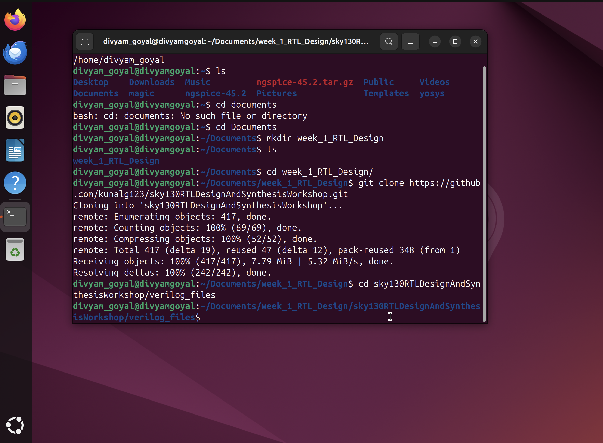
</div>

### Step 2: Install Required Tools

```shell
sudo apt install iverilog
sudo apt install gtkwave
```

###  Step 3: Simulate the Design

Compile the design and testbench:

```shell
iverilog good_mux.v tb_good_mux.v
```
<div align="center">
  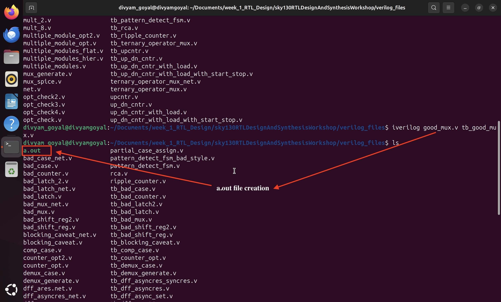
</div>
Run the simulation:

```shell
./a.out
```
<div align="center">
  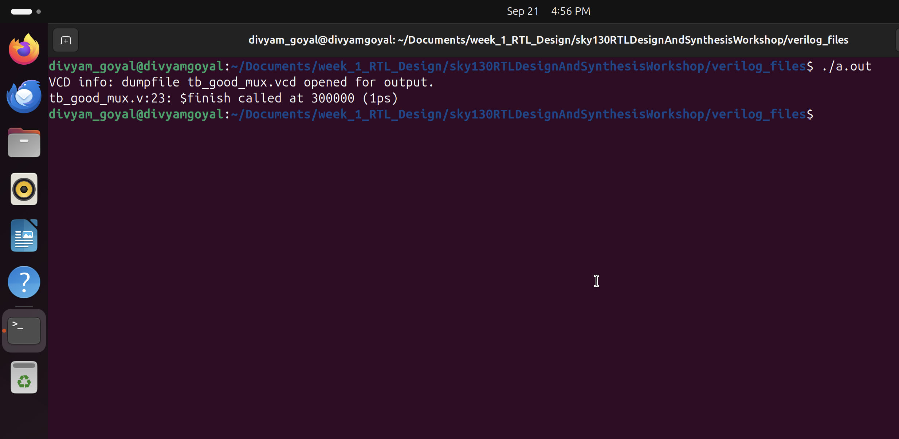
</div>
This creates a VCD File 

View the waveform:

```shell
gtkwave tb_good_mux.vcd
```

<div align="center">
  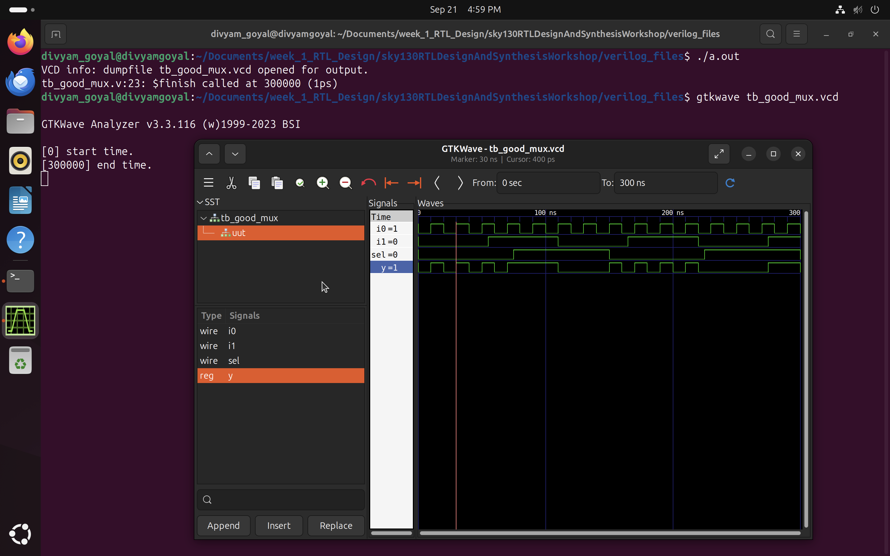
</div>

---

## 5. Verilog Code Analysis

2:1 Multiplexer in Verilog
This project contains the Verilog code for a simple 2:1 multiplexer (mux) and its corresponding testbench for functional verification.

Project Files
good_mux.v: This is the design file. It contains the Verilog module for the 2:1 mux.

tb_good_mux.v: This is the testbench file. It simulates the design by providing various inputs and generating a waveform file for analysis.

<div align="center">
  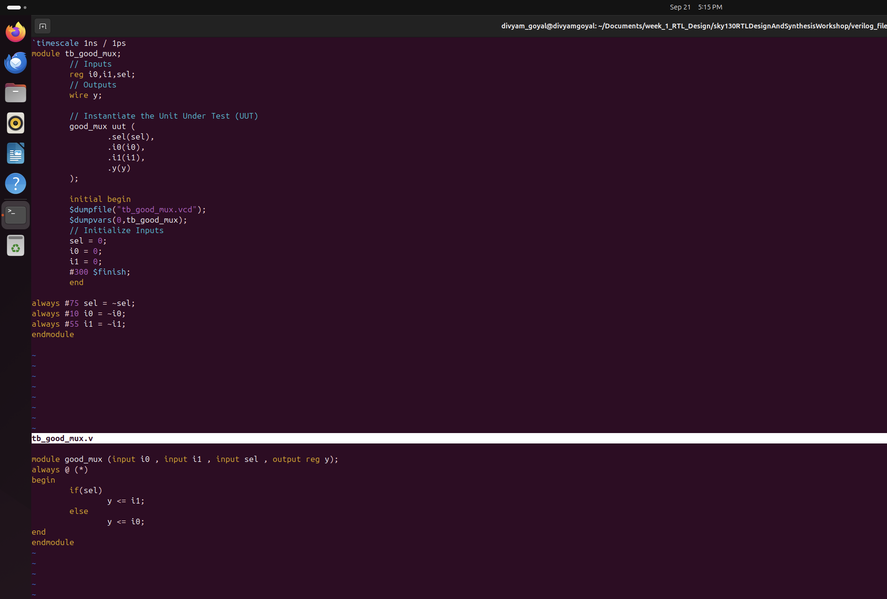
</div>

**The code for the multiplexer (`good_mux.v`):**

```verilog
module good_mux (input i0, input i1, input sel, output reg y);
always @ (*)
begin
    if(sel)
        y <= i1;
    else 
        y <= i0;
end
endmodule
```

###  **Working**

The good_mux module is a combinational circuit. It has two data inputs, i0 and i1, and a single select line, sel. The output y is determined by the sel signal:

If sel is 0, the output y will be equal to i0.

If sel is 1, the output y will be equal to i1

The Testbench (tb_good_mux.v)
```verilog timescale 1ns / 1ps
module tb_good_mux;

    // Inputs
    reg i0, i1, sel;
    // Outputs
    wire y;

    // Instantiate the Unit Under Test (UUT)
    good_mux good_mux_inst (
        .i0(i0),
        .i1(i1),
        .sel(sel),
        .y(y)
    );

    initial begin
        $dumpfile("tb_good_mux.vcd");
        $dumpvars(0, tb_good_mux);
        // Initialize Inputs
        sel = 0;
        i0 = 0;
        i1 = 0;
        #388 $finish;
    end
    
    always #75 sel = ~sel;
    always #10 i0 = ~i0;
    always #10 i1 = ~i1;

endmodule
```
This file is the verification environment for the multiplexer design. It doesn't get turned into a physical circuit. Instead, its job is to:

Instantiate the Design: It includes the good_mux module and connects its inputs and outputs to testbench signals.

Generate Stimulus: It uses initial and always blocks to provide a sequence of input values (i0, i1, sel) to the multiplexer over time.

Dump Waveforms: It uses the system tasks $dumpfile and $dumpvars to record the changes in all signals during the simulation, which creates the .vcd file for viewing.

---
## 6. Introduction to Yosys & Gate Libraries

###  What is Yosys?

**Yosys** is a powerful open-source synthesis tool for digital hardware. It takes the Verilog code and converts it into a gate-level netlist—a hardware blueprint.

<div align="center">
  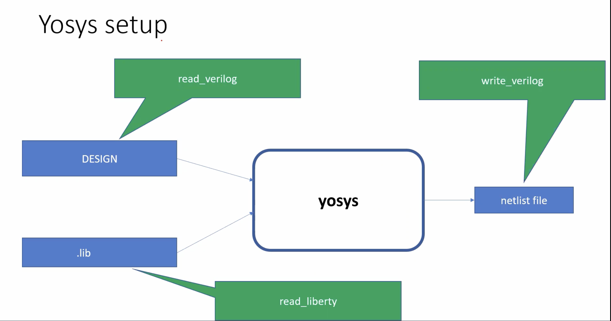
</div>

#### Yosys Features

- **Synthesis:** Converts HDL to a logic circuit
- **Optimization:** Improves speed or area
- **Technology Mapping:** Matches logic to actual hardware cells
- **Verification:** Checks correctness
- **Extensibility:** Supports custom flows

###  Why Do Libraries Have Different Gate "Flavors"?

A `.lib` file contains many versions of each gate (like AND, OR, NOT) with different properties:

- **Performance:** Faster gates for critical paths, slower for power savings
- **Power:** Some gates use less energy
- **Area:** Smaller gates for compact chips
- **Drive Strength:** Stronger gates to drive more load
- **Signal Integrity:** Specialized gates for noise/performance
- **Mapping:** Synthesis tools pick the best flavor for your needs

<div align="center">
  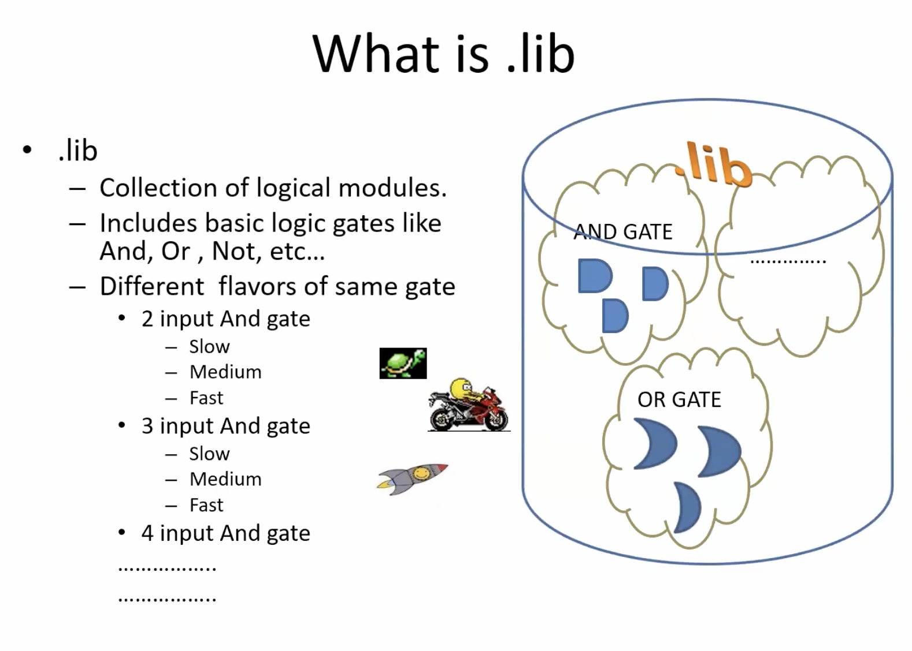
</div>

#### Cell Selection
<div align="center">
  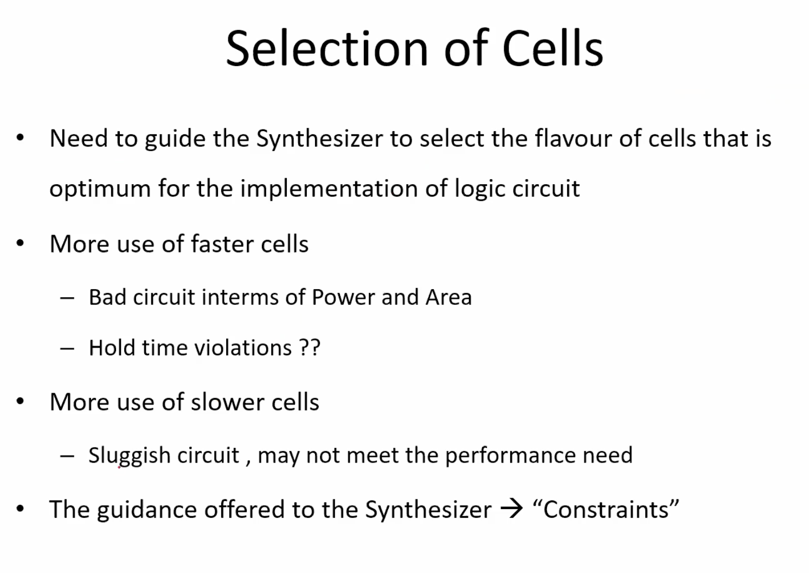
</div>
<div align="center">
  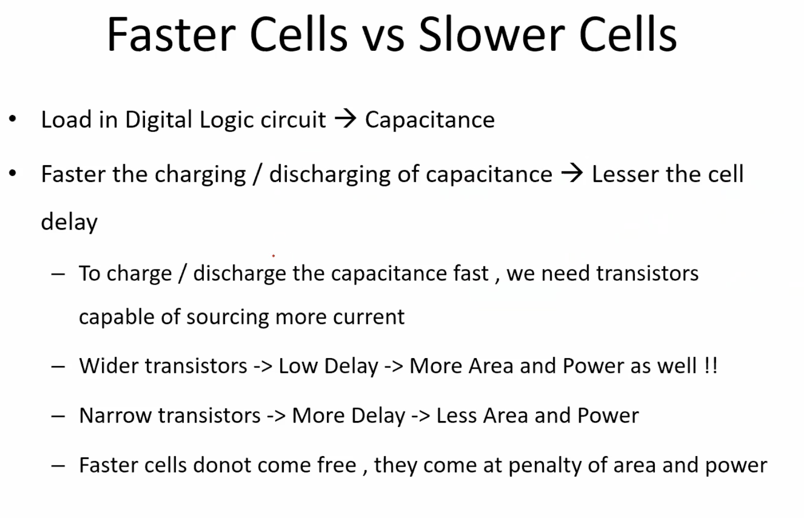
</div>

---

## 7. Synthesis Lab with Yosys

Let’s synthesize the `good_mux` design using Yosys!

###  Step-by-Step Yosys Flow

1. **Start Yosys**
    ```shell
    yosys
    ```

2. **Read the liberty library**
    ```shell
    read_liberty -lib ../my_lib/verilog_models/sky130_fd_sc_hd__tt_025C_1v80.lib
    ```

3. **Read the Verilog code**
    ```shell
    read_verilog good_mux.v
    ```

<div align="center">
  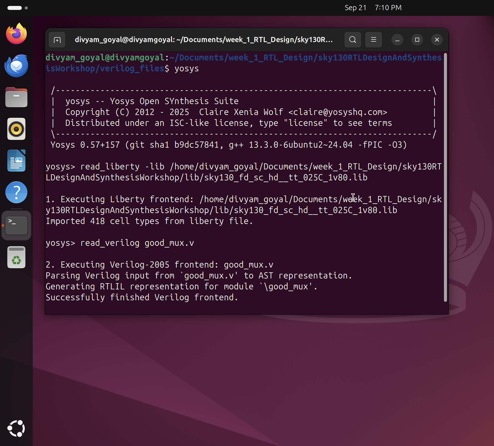
</div>

4. **Synthesize the design**
    ```shell
    synth -top good_mux
    ```

5. **Technology mapping**
    ```shell
    abc -liberty ../my_lib/verilog_models/sky130_fd_sc_hd__tt_025C_1v80.lib
    ```

6. **Visualize the gate-level netlist**
    ```shell
    show good_mux
    ```

<div align="center">
  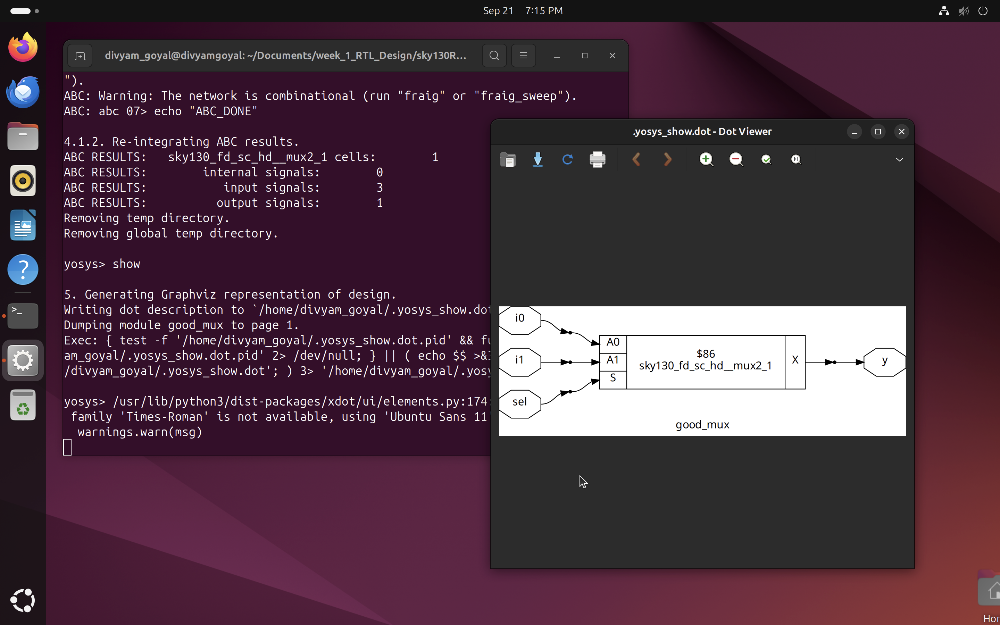
</div>

7. **gate-level netlist**
    ```shell
    write_verilog good_mux_netlist.v
    !vim good_mux_netlist.v
    ```
<div align="center">
  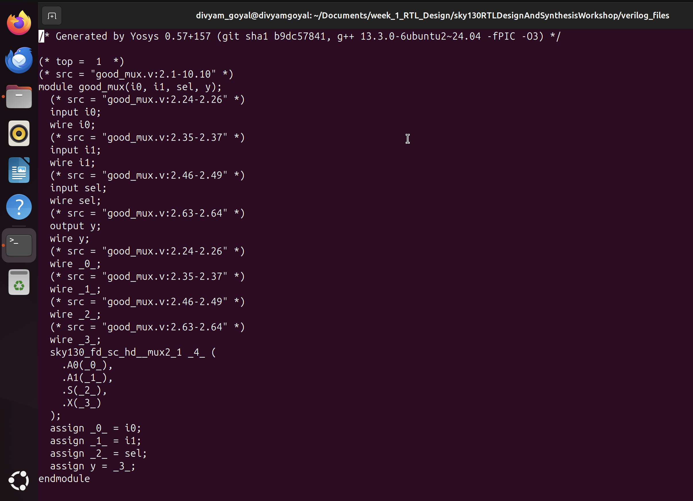
</div>

---
## 8. Summary

- Learned about simulators, designs, and testbenches.
- Ran my first Verilog simulation with iverilog and visualized waveforms.
- Analyzed the 2-to-1 mux code.
- Explored Yosys and learned why gate libraries have various flavors.

---
