# Day 2: Timing libs, Hierarchical vs Flat Synthesis and Efficient Flop Coding Styles
---
## Introduction to timing .libs

**Libraries are characterized based on PVT (process, voltage, temperature) \
Process -> Variations due to fabrication \
Voltage -> Variations due to voltage \
Temperature -> Variations due to temperature**

when we open the sky_lib library file then all the information about the library is visible like - \
**tt stands for typical in the .lib name \
025C stands for temperature of 25 C in the .lib name \
1v80 stands for voltage of 1.8V in the .lib name**
<div align="center">
  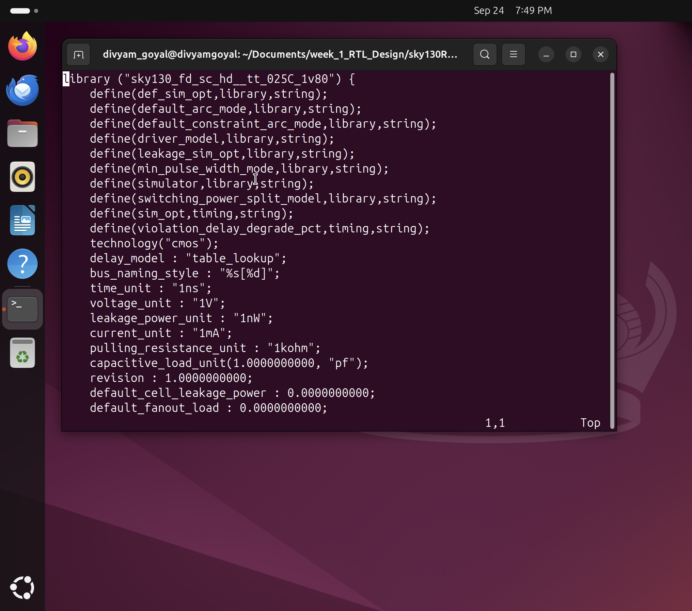
</div>

-cell defines the beginning of the cell. Other information of cells mentioned are:
- Leakage power based on the combination of inputs
- Area
- Power ports
- Input capacitance
- Power associated with the pin
- Transition
- Delay

---
## Hierarchical vs Flat Synthesis

###  Synthesis Procedure

1. **Start Yosys**
    ```shell
    yosys
    ```

2. **Read the liberty library**
    ```shell
    read_liberty -lib ../my_lib/verilog_models/sky130_fd_sc_hd__tt_025C_1v80.lib
    ```

3. **Read the Verilog code**
    ```shell
    read_verilog <filename.v>
    ```

4. **Synthesize the design**
    ```shell
    synth -top <module>
    ```

5. **Technology mapping**
    ```shell
    abc -liberty ../my_lib/verilog_models/sky130_fd_sc_hd__tt_025C_1v80.lib
    ```

6. **Visualize the gate-level netlist**
    ```shell
    show <module>
    ```

7. **gate-level netlist**
    ```shell
    write_verilog <filename_netlist.v>
    !vim <filename_netlist.v>
    ```
8. **For Flatten Synthesis**
    ```shell
    flatten <module>
    abc -liberty ../my_lib/verilog_models/sky130_fd_sc_hd__tt_025C_1v80.lib
    ```

---
### Hierarchical Synthesis
Lets take an example of a module containing submodules like -
```verilog 
module sub_module2 (input a, input b, output y);
	assign y = a | b;
endmodule

module sub_module1 (input a, input b, output y);
	assign y = a&b;
endmodule

module multiple_modules (input a, input b, input c , output y);
	wire net1;
	sub_module1 u1(.a(a),.b(b),.y(net1));  //net1 = a&b
	sub_module2 u2(.a(net1),.b(c),.y(y));  //y = net1|c ,ie y = a&b + c;
endmodule
```
<div align="center">
  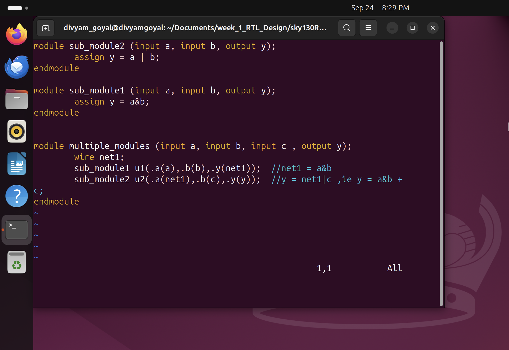
</div>

Report after synthesizing multiple_modules.v. As shown below the sub_modules statistics are printed. For example, sub-module1 has 1 AND gate and sub-module2 has 1 OR gate. This is an example of Hierarchical Synthesis.
<div align="center">
  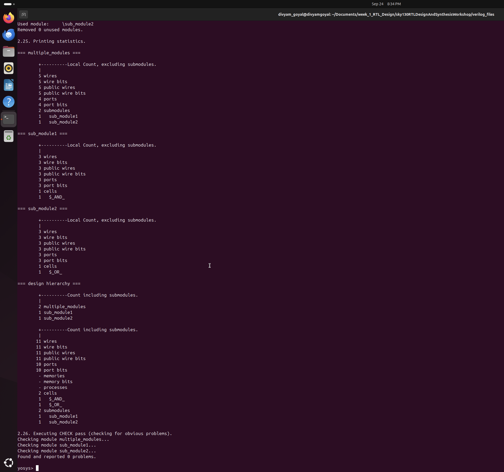
</div>

Hierarchy is preserved. sub_module1 and sub_module2 are instantiated separately in the synthesized Verilog netlist. Rather than seeing AND or OR gate, we see sub_modules when we run the command 'show' as shown in the screenshot.

<div align="center">
  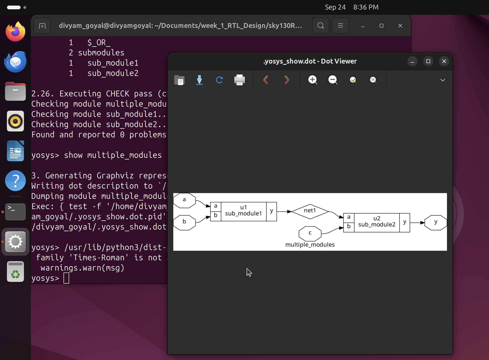
</div>

For **gate-level netlist** 
```shell
write_verilog hier_netlist.v
!vim hier_netlist.v
```
    
<div align="center">
  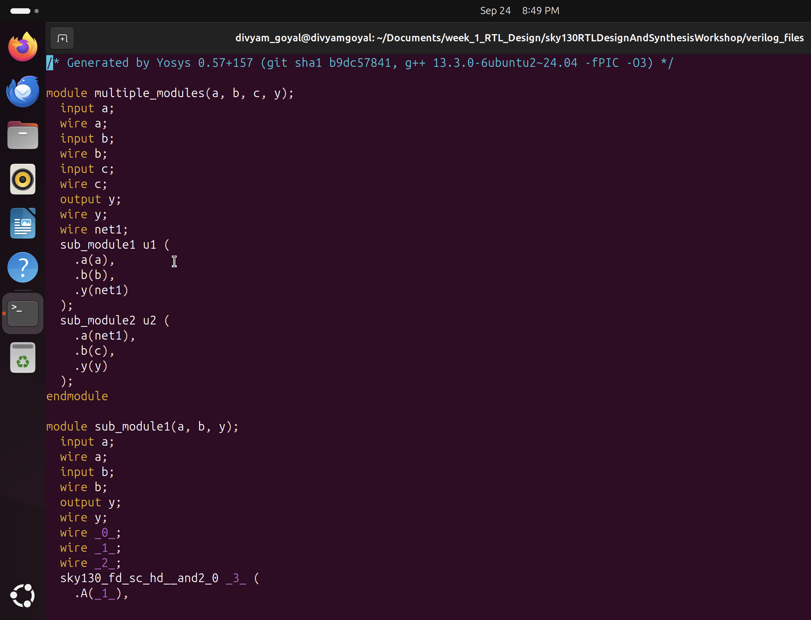
</div>
<div align="center">
  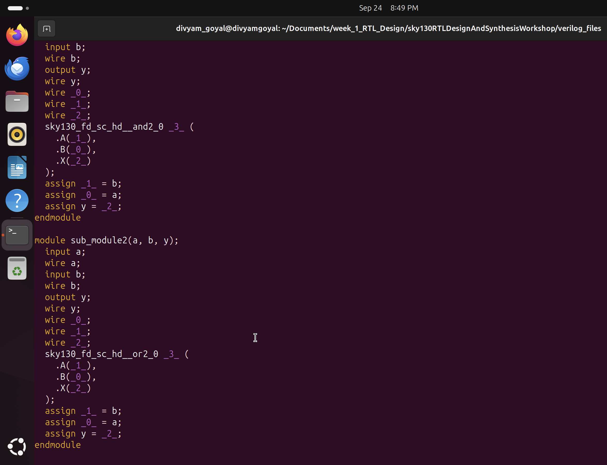
</div>

**Advantages:**
-Faster synthesis time for large designs.
-Improved debugging and analysis due to maintained module boundaries.
-Modular approach, aiding integration with other tools.

**Disadvantages:**
-Cross-module optimizations are limited.
Reporting can require additional configuration.

---
### Flat Synthesis
The design can be flattened by using the command `flatten`.
The gate level implementation after synthesis is shown as below -
<div align="center">
  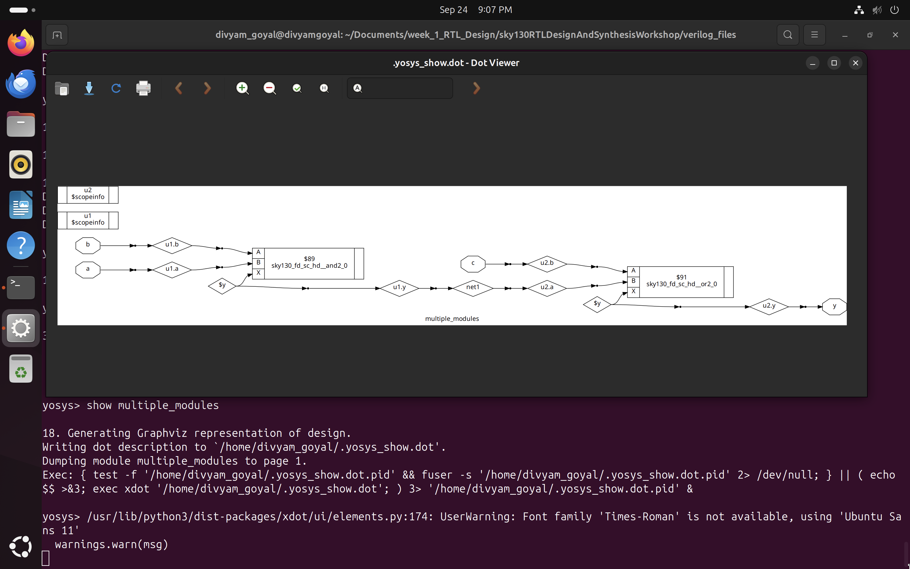
</div>

Hierarchy is not preserved. sub_module1 and sub_module2 are now seen as AND or OR gate which is different from the earlier `hierarchical_schematic`.
Flatten netlist -
<div align="center">
  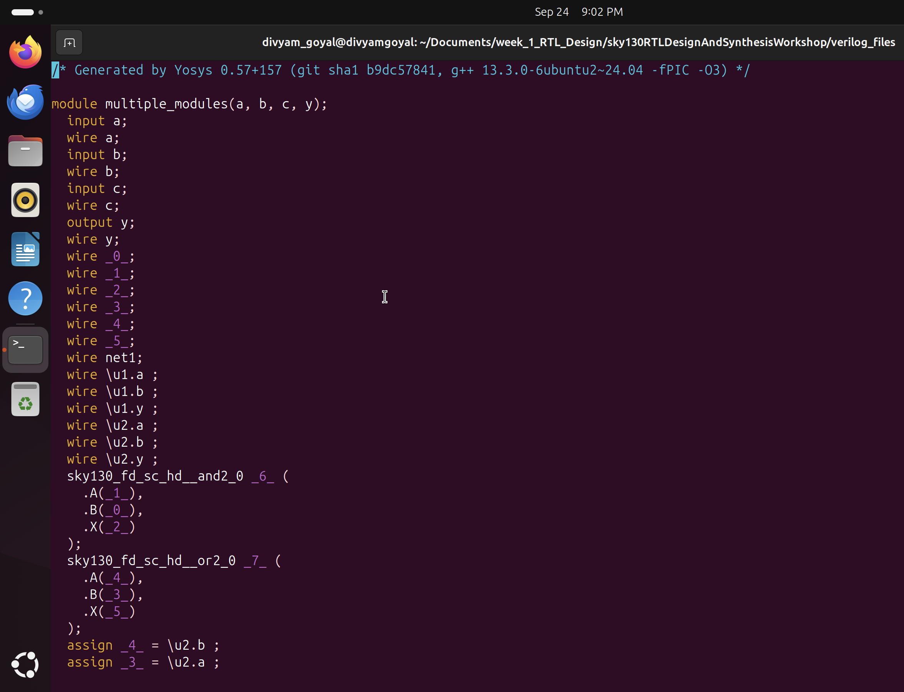
</div>
<div align="center">
  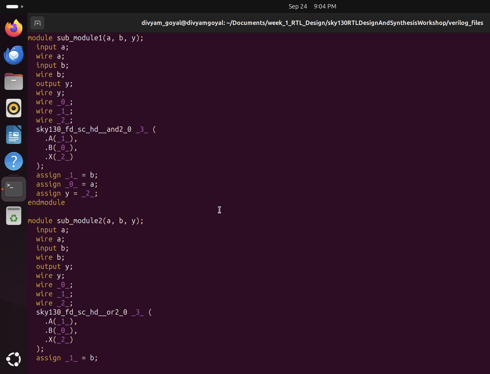
</div>

**Advantages:**
-Enables aggressive, cross-module optimizations.
-Results in a unified netlist, sometimes simplifying downstream processes.

**Disadvantages:**
-Longer runtime for large designs.
-Loss of hierarchy complicates debugging and reporting.
-Can increase memory usage and netlist complexity.

Following image shows the comparsion of hierarchical_netlist vs flat_netlist
<div align="center">
  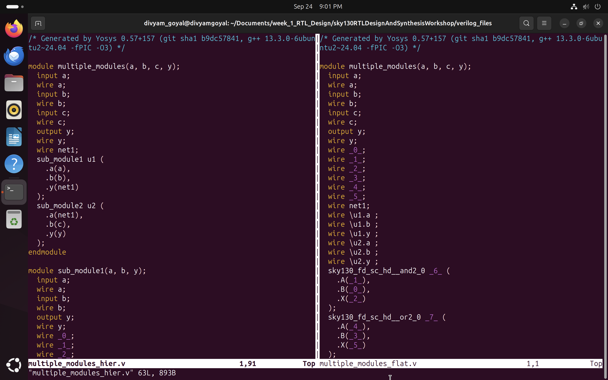
</div>

### Key Differences

| Aspect                | Hierarchical Synthesis             | Flattened Synthesis           |
|-----------------------|------------------------------------|------------------------------|
| Hierarchy             | Preserved                          | Collapsed                    |
| Optimization Scope    | Module-level only                  | Whole-design                 |
| Runtime               | Faster for large designs           | Slower for large designs     |
| Debugging             | Easier (traces to RTL)             | Harder                       |
| Output Complexity     | Modular structure                  | Single, complex netlist      |
| Use Case              | Modularity, analysis, reporting    | Maximum optimization         |

---
### Sub-module Level Synthesis
RTL (Register Transfer Level) designs are often modular, with various functional blocks or sub-modules. Sub-module level synthesis allows each of these sub-modules to be synthesized independently.

Why is the sub-module level synthesis necessary?
- Optimization and Area Reduction: By synthesizing sub-modules separately, the synthesis tool can optimize each one individually. It performs logic optimization, technology mapping, and area minimization for each sub-module. This leads to more efficient use of resources and reduced overall chip area.
- Resuability: Each submodule can be designed, verified, and optimized independently. They can be reused in a large design multiple times saving time and enhancing efficiency. 
- Parallel Processing: Different sub-modules can be synthesized concurrently, improving efficiency. For large designs, parallel synthesis significantly reduces turnaround time.

The commands to run sub-module synthesis
```
read_liberty -lib ../my_lib/verilog_models/sky130_fd_sc_hd__tt_025C_1v80.lib
read_verilog multiple_modules.v
synth -top sub_module1
abc -liberty ../my_lib/verilog_models/sky130_fd_sc_hd__tt_025C_1v80.lib
show sub_module1
```

## Various Flop Coding Styles and Optimization

### Why do we need flops and how do they prevent glitches in the circuit?

Glitches can occur in digital circuits due to various reasons such as signal delays, noise, or timing issues. Flops prevent glitches during the operation in the following ways:
- Synchronization: Flops are edge-triggered devices, meaning they respond only to transitions of the input signal (e.g., rising edge, falling edge). This synchronization ensures that the output changes only at specific points, reducing the likelihood of glitches caused by transient signal variations.
- Timing Control: Flops are typically controlled by a clock signal, ensuring that all circuit operations occur synchronously. This eliminates timing issues that could lead to glitches due to data arriving at different times.

### Different types of flops
Flip-flops are fundamental sequential elements in digital design, used to store binary data. Below are efficient coding styles for different reset/set behaviors.
To initialize flops, we need to `set` and `reset` which can be synchronous or asynchronous.

### Asynchronous Reset D Flip-Flop

```verilog
module dff_asyncres (input clk, input async_reset, input d, output reg q);
  always @ (posedge clk, posedge async_reset)
    if (async_reset)
      q <= 1'b0;
    else
      q <= d;
endmodule
```
- **Asynchronous reset**: Overrides clock, setting q to 0 immediately.
- **Edge-triggered**: Captures d on rising clock edge if reset is low.

### Asynchronous Set D Flip-Flop

```verilog
module dff_async_set (input clk, input async_set, input d, output reg q);
  always @ (posedge clk, posedge async_set)
    if (async_set)
      q <= 1'b1;
    else
      q <= d;
endmodule
```
- **Asynchronous set**: Overrides clock, setting q to 1 immediately.

### Synchronous Reset D Flip-Flop

```verilog
module dff_syncres (input clk, input async_reset, input sync_reset, input d, output reg q);
  always @ (posedge clk)
    if (sync_reset)
      q <= 1'b0;
    else
      q <= d;
endmodule
```
- **Synchronous reset**: Takes effect only on the clock edge.

### Simulation and Synthesizing flops

### Icarus Verilog Simulation

1. **Compile:**
   ```shell
   iverilog dff_asyncres.v tb_dff_asyncres.v
   ```
2. **Run:**
   ```shell
   ./a.out
   ```
3. **View Waveform:**
   ```shell
   gtkwave tb_dff_asyncres.vcd
   ```
The screenshot below shows DFF with asynchronous reset HDL simulation in Iverilog and waveform display in GTKwave. Irrespective of the clock and d, as soon as async_reset=1, q=0.

<div align="center">
  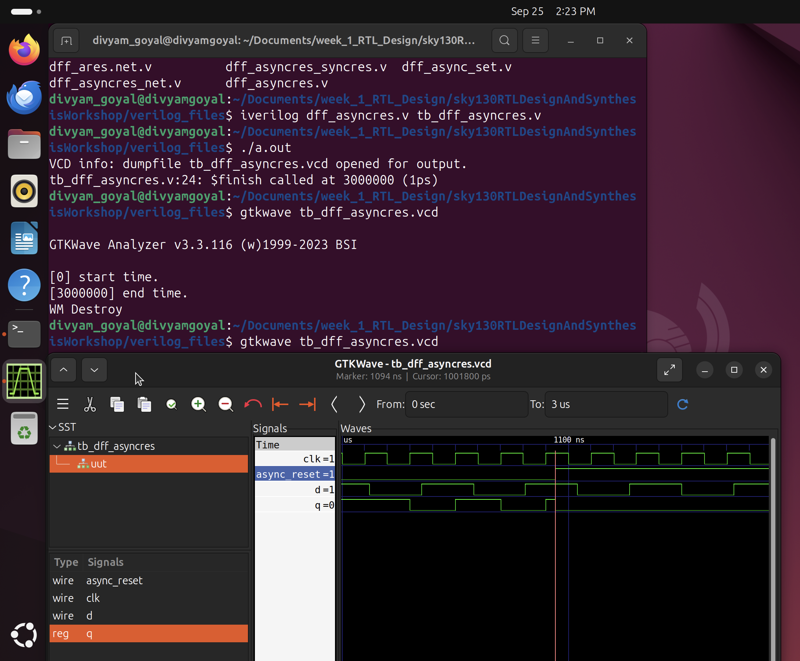
</div>

Similarly we can simulate other flipflops - \
`dff_async_set`
<div align="center">
  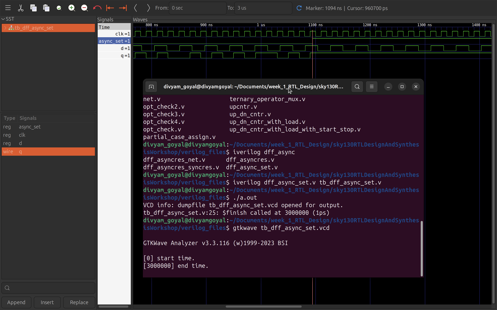
</div>

`dff_sync_reset`
<div align="center">
  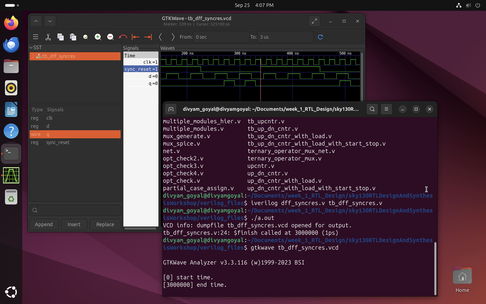
</div>

### Synthesis with Yosys
The command to synthesize ***DFF with asynchronous reset*** as an example -
1. Start Yosys:
   ```shell
   yosys
   ```
2. Read Liberty library:
   ```shell
   read_liberty -lib ../my_lib/verilog_models/sky130_fd_sc_hd__tt_025C_1v80.lib
   ```
3. Read Verilog code:
   ```shell
   read_verilog dff_asyncres.v
   ```
4. Synthesize:
   ```shell
   synth -top dff_asyncres
   ```
5. Map flip-flops:
   ```shell
   dfflibmap -liberty ../my_lib/verilog_models/sky130_fd_sc_hd__tt_025C_1v80.lib
   ```
6. Technology mapping:
   ```shell
   abc -liberty ../my_lib/verilog_models/sky130_fd_sc_hd__tt_025C_1v80.lib
   ```
7. Visualize the gate-level netlist:
   ```shell
   show dff_asyncres
   ```

On synthesizing ***DFF with synchronous reset*** we get NOR gate with inverted `d` as shown in the screenshot below. However,on evaluating the boolean expression, we reached the same logic realization. 
<div align="center">
  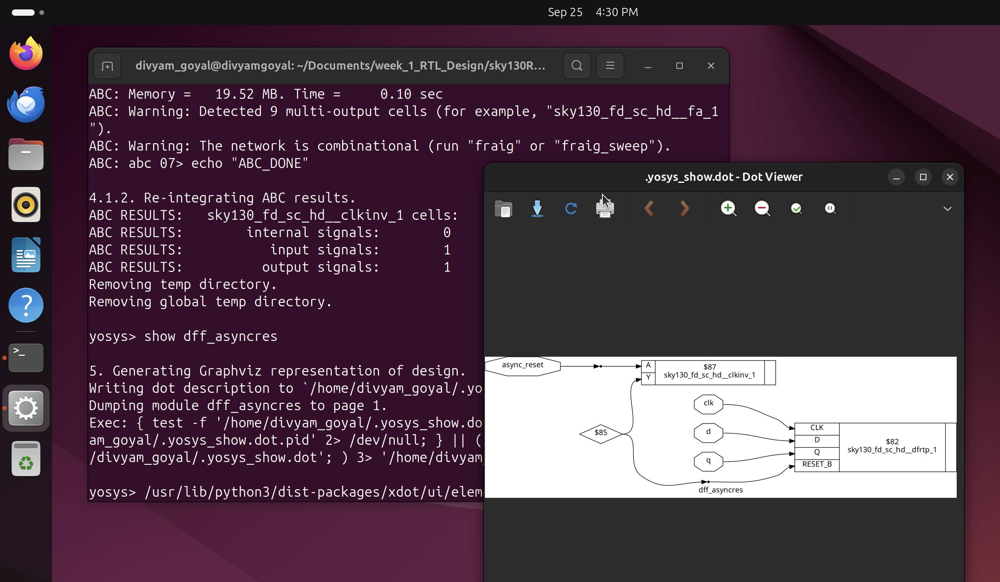
</div>
Similarly we get the synthesis for -

`dff_async_set`
<div align="center">
  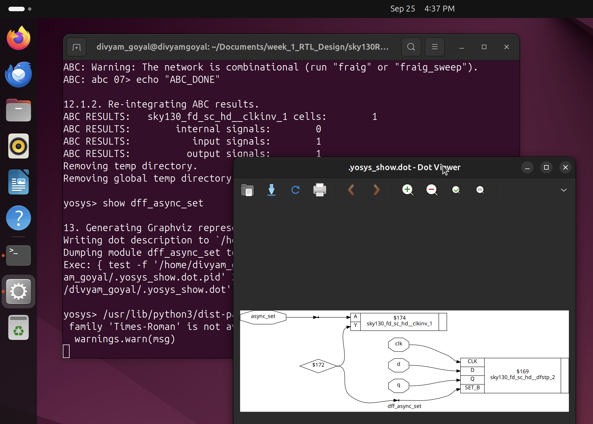
</div>

`dff_sync_reset`
<div align="center">
  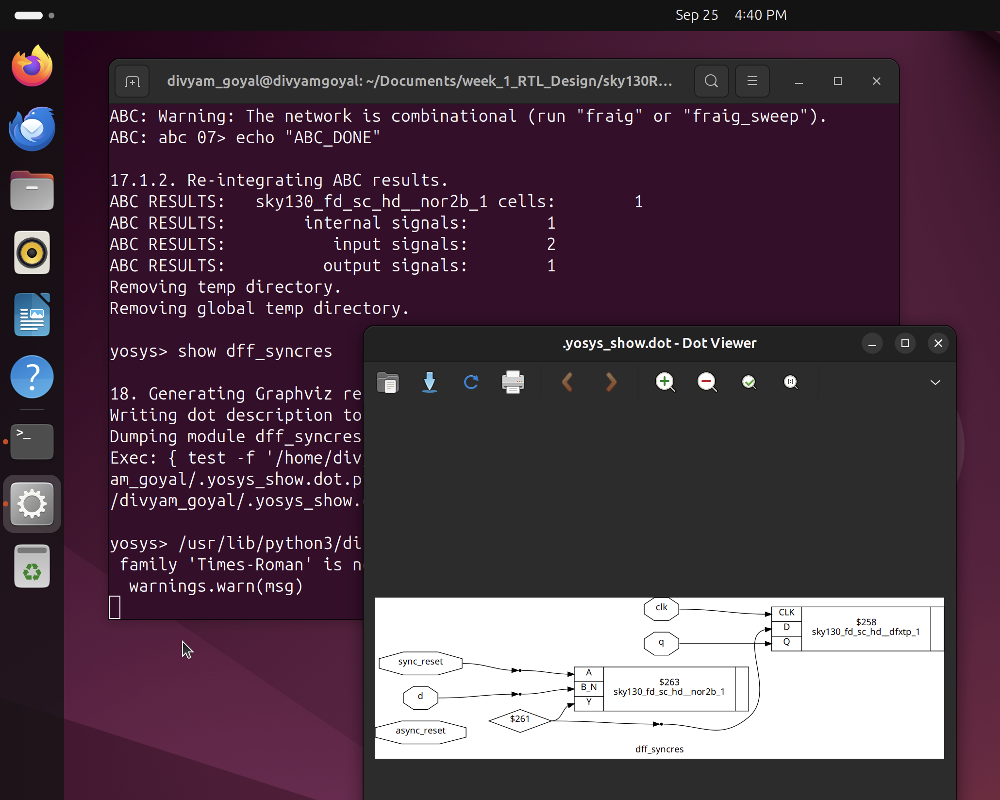
</div>

### Synthesizing mult2 (multiply by 2)

To implement `y[3:0] = 2*a[2:0]`, we append a `1'b0 `to the `a[2:0]` i.e, `y[3:0] = {a[2:0],0}`. This is also equal to left shift the input bits by 1.
This can be realized by just wiring.
So we expect no hardware which is also seen in the screenshot below, analysis after synthesis and show. The command 'abc' is not required for mapping when there are no cells.

<div align="center">
  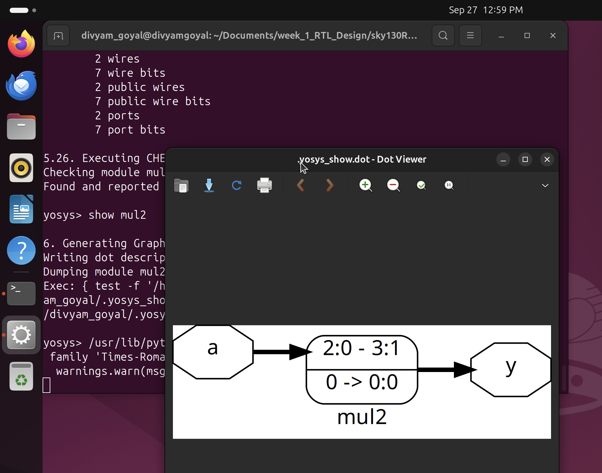
</div>

<div align="center">
  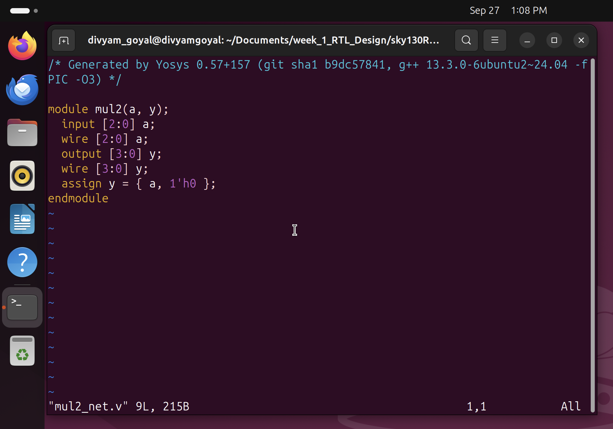
</div>

### Synthesizing mult9 (multiply by 9 or 8+1)

`y=9*a` can be considered `8*a+1*a`
To implement `y[5:0] = 9*a[2:0]`, we append `000` to `a[2:0]` and then add `a` i.e, `y[5:0] = {a[2:0],000} + a[2:0]`.
This can be realized just by wiring.
So we expect no hardware which is also seen in the screenshot below, analysis after synthesis and show. The command 'abc' is not required for mapping when there are no cells.

<div align="center">
  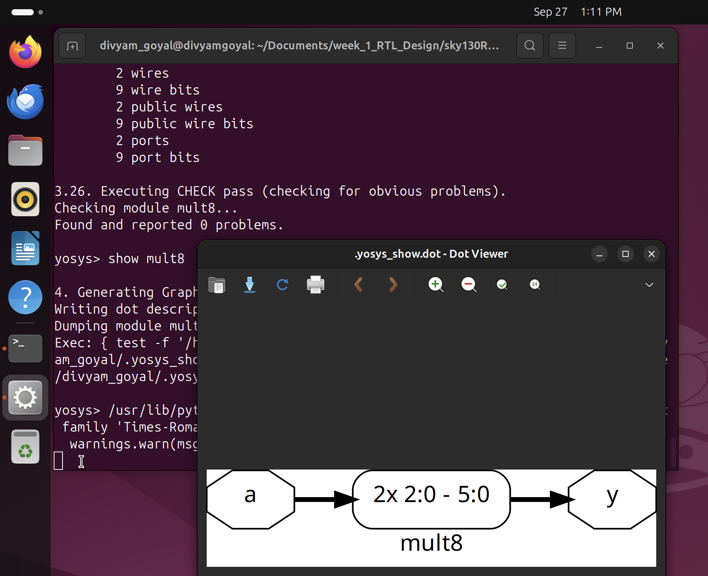
</div>

<div align="center">
  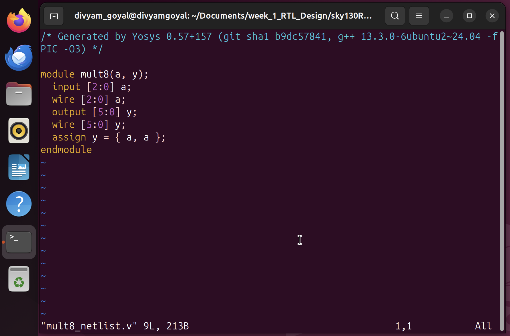
</div>
