# Day 4: GLS, blocking vs non-blocking and Synthesis-Simulation mismatch

## Table of Contents
- [Gate Level Simulation](#gate-level-simulation-gls)  
- [Synthesis - Simulation mismatch](#synthesis---simulation-mismatch)
- [Synthesis of Ternary Operator MUX](#synthesis-of-ternary-operator-mux)  
- [GLS of Ternary Operator MUX](#gls-of-ternary-operator-mux)  
- [Synthesis of Bad MUX design](#synthesis-of-bad-mux-design)  
- [GLS of Bad MUX design](#gls-of-bad-mux-design)  
- [Synthesis of blocking_caveat design](#synthesis-of-blocking_caveat-design)  
- [GLS of blocking_caveat design](#gls-of-blocking_caveat-design)  

---
## Gate Level Simulation (GLS)
  * _Gate Level_ refers to the netlist view of a design after the synthesis has been performed.
  * RTL simulations are pre-synthesis, while GLS is post-synthesis - i.e., in RTL simulations, the Device Under Test (DUT) is the RTL design itself while in GLS, the DUT is the netlist generated after synthesis.
  * The RTL code and the generated netlist are logically equivalent (well, supposed to be!)  and hence the same testbenches can be used to verify both.
  * Although it is expected that the generated netlist has the same logical correctness as the RTL design, there can sometimes be mismatches between the RTL-level simulation and the sythesized design (Synthesis - Simulation mismatch) and thus arises the need to run GLS to help identify such scenarios and fix them to ensure the logical correctness post-synthesis as well.

To run GLS, we need to provide the Gate level netlist, the testbench and the Gate Level verilog models to the simulator.  
GLS can be run in different delay modes:
   1. Functional validation (zero delay similar to RTL sim): if the Gate Level verilog models do not have the timing information for various corners, we can only verify the functional correctness of the design by running GLS.
   2. Full Timing validation: if the Gate level verilog models have the necessary timing information, both the functional correctness and the timing behaviour can be verified by GLS.
   
<div align="center">
  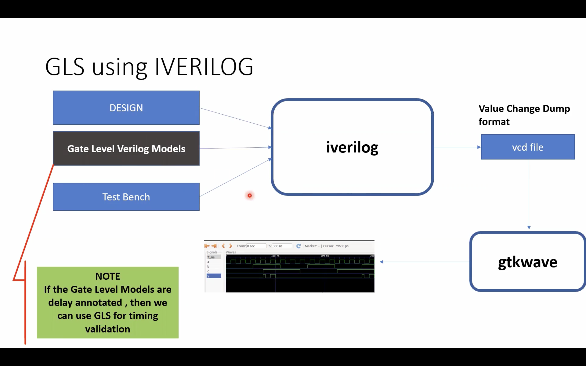
</div>

### Why Perform GLS?

- **Synthesis Validation**: Ensures that synthesis tools faithfully translate RTL into gates.
- **Timing Verification**: Simulates with realistic delays (from SDF files), allowing you to check for timing violations (e.g., setup/hold errors).
- **Testability**: Confirms that scan chains and other test features work post-synthesis.

### When is GLS Performed?

- **After synthesis**: Once the RTL is converted into a gate-level netlist.
- **Before physical design**: To catch issues early, before layout.

### Types of GLS

- **Functional GLS**: Logic-only simulation, often with zero or unit delays.
- **Timing GLS**: Uses annotated timing data to check real-world timing behavior.

---
## Synthesis - Simulation mismatch

A **synthesis-simulation mismatch** occurs when the simulation results of RTL (pre-synthesis) do not match simulation results of the gate-level netlist (post-synthesis) or hardware. Reasons include:

- **Non-synthesizable constructs**: Use of delays, initial blocks, or other code not supported by synthesis.
- **Incomplete or ambiguous coding**: E.g., missing `else` clauses, improper sensitivity lists.
- **Tool interpretation differences**: Simulation and synthesis tools may interpret ambiguous RTL differently.

**Key Point:** Always write synthesizable, unambiguous RTL and follow good coding practices to minimize mismatches.

Some of the common reasons for Synthesis - Simulation mismatch (mismatch between pre- and post-synthesis simulations) :  
  * Incomplete sensitivity list
  * Use of blocking assignments inside always block vs. non-blocking assignments
    * Blocking assignments ("=") inside always block are executed sequentially by the simulator.
    * The RHS of non-blocking assignments ("<=") are evaluated first and then assigned to the LHS at the same simulation clock tick by the simulator. 
    * Synthesis will yield the same circuit with blocking and non-blocking assignments, with the synthesis output being that of the non-blocking case for both.
    * Hence, if the RTL was written assuming one functionality using blocking assignments, a simulation mismatch can occur in GLS.
  * Non-standard verilog coding
    
<div align="center">
  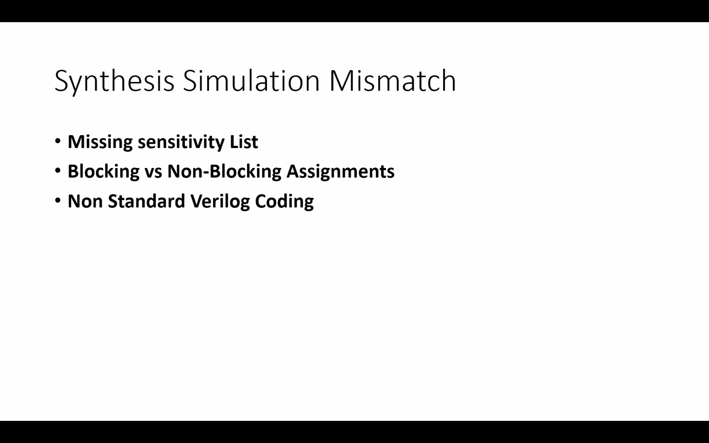
</div>

---

For ex: As seen in the screenshot below, in the left column,always block is evaluated only when sel is changing. So output y is not reflecting changes in input i1 and i0 when sel is not changing. Rather it acts like a latch. 

The code on the right side represents the correct design coding for mux. In this case always is evaluated for any signal changes.

<div align="center">
  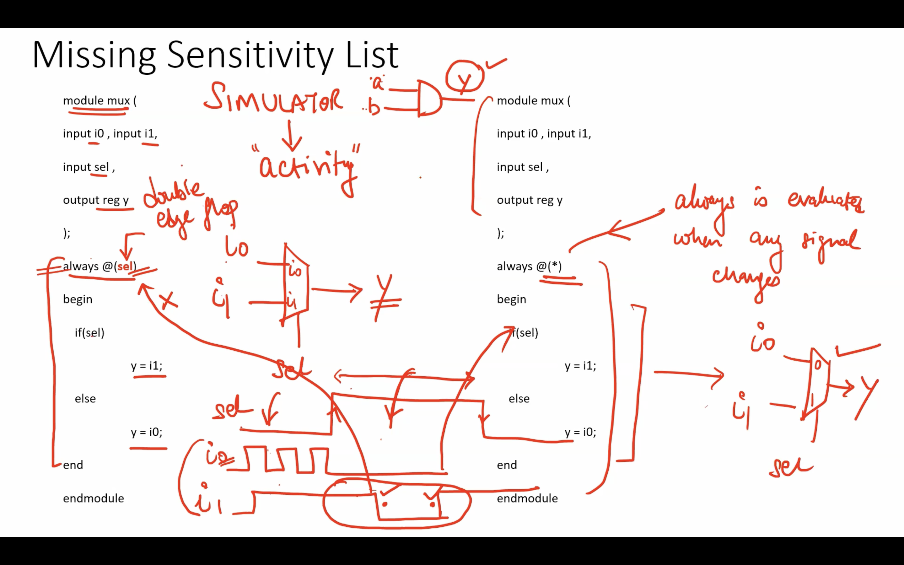
</div>

<div align="center">
  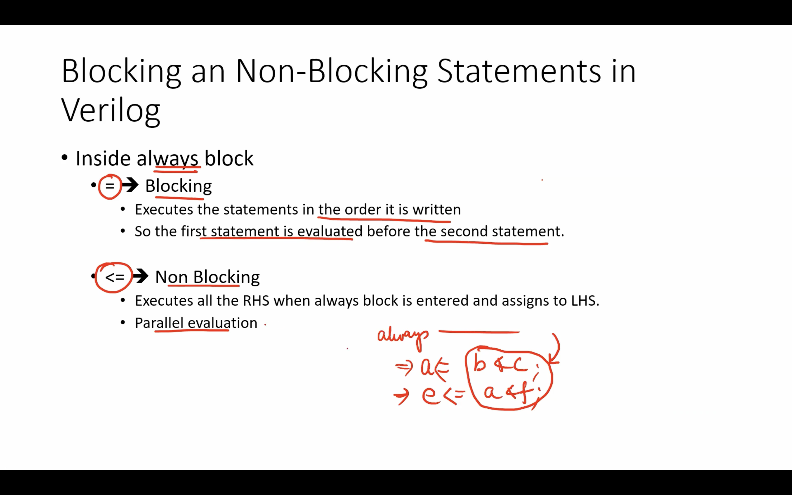
</div>

<div align="center">
  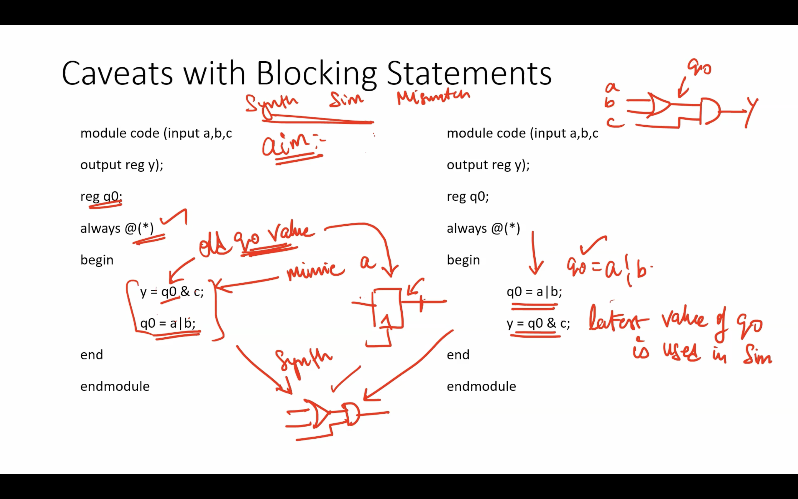
</div>

---
## Synthesis of Ternary Operator MUX

``ternary_operator_mux.v ``
```verilog
module ternary_operator_mux (input i0 , input i1 , input sel , output y);
	assign y = sel?i1:i0;
	endmodule
```
Testbench ``tb_ternary_operator_mux.v``

```verilog 

`timescale 1ns / 1ps
module tb_ternary_operator_mux;
	// Inputs
	reg i0,i1,sel;
	// Outputs
	wire y;

        // Instantiate the Unit Under Test (UUT)
	ternary_operator_mux uut (
		.sel(sel),
		.i0(i0),
		.i1(i1),
		.y(y)
	);

	initial begin
	$dumpfile("tb_ternary_operator_mux.vcd");
	$dumpvars(0,tb_ternary_operator_mux);
	// Initialize Inputs
	sel = 0;
	i0 = 0;
	i1 = 0;
	#300 $finish;
	end

always #75 sel = ~sel;
always #10 i0 = ~i0;
always #55 i1 = ~i1;
endmodule
```

### `RTL simulation`

```shell
iverilog ternary_operator_mux.v tb_ternary_operator_mux.v
./a.out
gtkwave tb_ternary_operator_mux.vcd
```

<div align="center">
  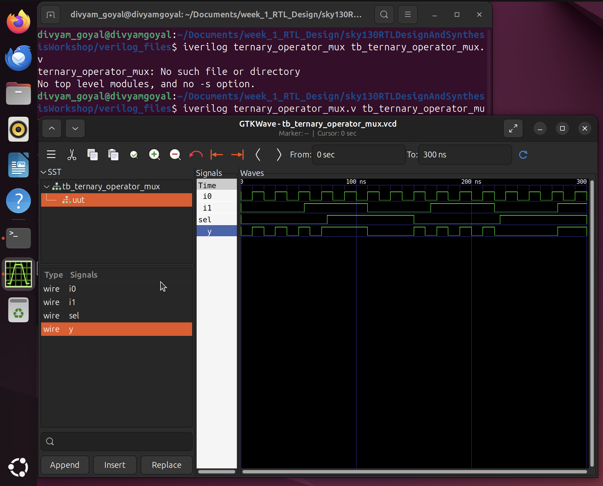
</div>

Steps for Netlist Generation
1. **Start Yosys**
    ```shell
    yosys
    ```

2. **Read the liberty library**
    ```shell
    read_liberty -lib ../my_lib/verilog_models/sky130_fd_sc_hd__tt_025C_1v80.lib
    ```

3. **Read the Verilog code**
    ```shell
    read_verilog ternary_operator_mux.v
    ```

4. **Synthesize the design**
    ```shell
    synth -top ternary_operator_mux
    ```

5. **Technology mapping**
    ```shell
    abc -liberty ../my_lib/verilog_models/sky130_fd_sc_hd__tt_025C_1v80.lib
    ```

6. **Visualize the gate-level netlist**
    ```shell
    show ternary_operator_mux
    ```

7. **gate-level netlist**
    ```shell
    write_verilog -noattr ternary_operator_mux_netlist.v
    !vim ternary_operator_mux_netlist.v
    ```

---
## GLS of Ternary Operator MUX

Gate-Level Simulation is performed using the synthesized netlist (ternary_operator_mux_netlist.v) instead of RTL. This helps verify the functional correctness of the design after synthesis, using the actual standard cells and any delays (if modeled)

```bash
# Compile the gate-level netlist and testbench
iverilog ../my_lib/verilog_model/primitives.v  ../my_lib/verilog_model/sky130_fd_sc_hd.v ternary_operator_mux_net.v tb_ternary_operator_mux.v

# Run the simulation binary
./a.out

# View the waveform
gtkwave tb_ternary_operator_mux.vcd
```

<div align="center">
  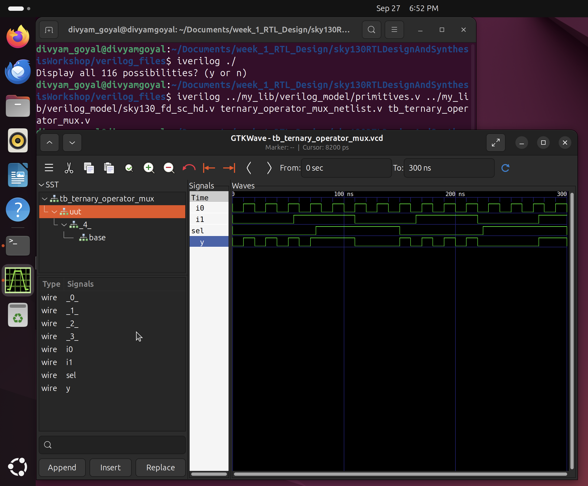
</div>

## Synthesis of Bad MUX design
``bad_mux.v``
```verilog
module bad_mux (input i0 , input i1 , input sel , output reg y);
always @ (sel)
begin
	if(sel)
		y <= i1;
	else 
		y <= i0;
end
endmodule
```
This bad_mux uses a blocking sensitivity list (@ (sel)) without including data inputs (i0, i1), leading to a simulation-synthesis mismatch due to incomplete sensitivity.


Testbench ``tb_bad_mux.v``
```verilog
`timescale 1ns / 1ps
module tb_bad_mux;
	// Inputs
	reg i0,i1,sel;
	// Outputs
	wire y;

        // Instantiate the Unit Under Test (UUT)
	bad_mux uut (
		.sel(sel),
		.i0(i0),
		.i1(i1),
		.y(y)
	);

	initial begin
	$dumpfile("tb_bad_mux.vcd");
	$dumpvars(0,tb_bad_mux);
	// Initialize Inputs
	sel = 1'b0;
	i0 = 1'b0;
	i1 = 1'b0;
	#300 $finish;
	end

always #75 sel = ~sel;
always #10 i0 = ~i0;
always #55 i1 = ~i1;
endmodule
```

### `RTL simulation`

```bash
iverilog bad_mux.v tb_bad_mux.v
./a.out
gtkwave tb_bad_mux.vcd
```
<div align="center">
  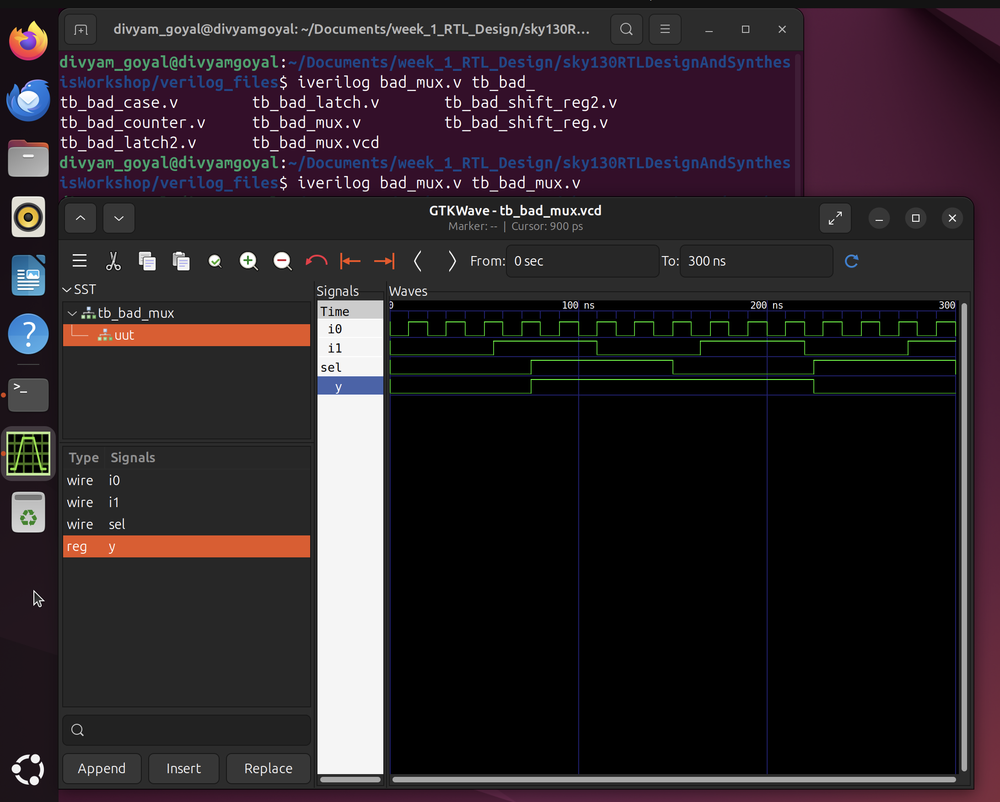
</div>

After this synthesise the netlist using yosys 

---
## GLS of Bad MUX design

```bash
iverilog ../my_lib/verilog_model/primitives.v  ../my_lib/verilog_model/sky130_fd_sc_hd.v bad_mux_netlist.v tb_bad_mux.v
./a.out
gtkwave tb_bad_mux.vcd
```
<div align="center">
  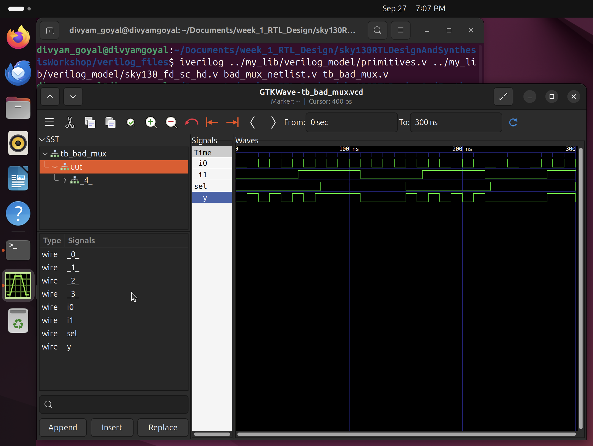
</div>

So clearly their is a Synthesis-Simulation Mismatch of Bad MUX design
The waveform illustrates a `synthesis vs. simulation mismatch` caused by the RTL not including i0 and i1 in the sensitivity list.

---
## Synthesis of blocking_caveat design

``blocking_caveat.v``
```verilog
module blocking_caveat (input a , input b , input  c, output reg d); 
reg x;
always @ (*)
begin
	d = x & c;
	x = a | b;
end
endmodule
```

Testbench ``tb_blocking_caveat.v``
```verilog
`timescale 1ns / 1ps
module tb_blocking_caveat;
	// Inputs
	reg a,b,c   ;
	// Output
	wire d;

        // Instantiate the Unit Under Test (UUT)
	blocking_caveat uut (
		.a(a),
		.b(b),
		.c(c),
		.d(d)
	);

	initial begin
	$dumpfile("tb_blocking_caveat.vcd");
	$dumpvars(0,tb_blocking_caveat);
	// Initialize Inputs
	a = 0;
	b = 0;
	c = 0;
	#3000 $finish;
	end

always #10 a = ~a;
always #100 c =~c;
always #50 b = ~b;
endmodule
```

### RTL simulation

```bash
iverilog blocking_caveat.v tb_blocking_caveat.v
./a.out
gtkwave tb_blocking_caveat.vcd
```
<div align="center">
  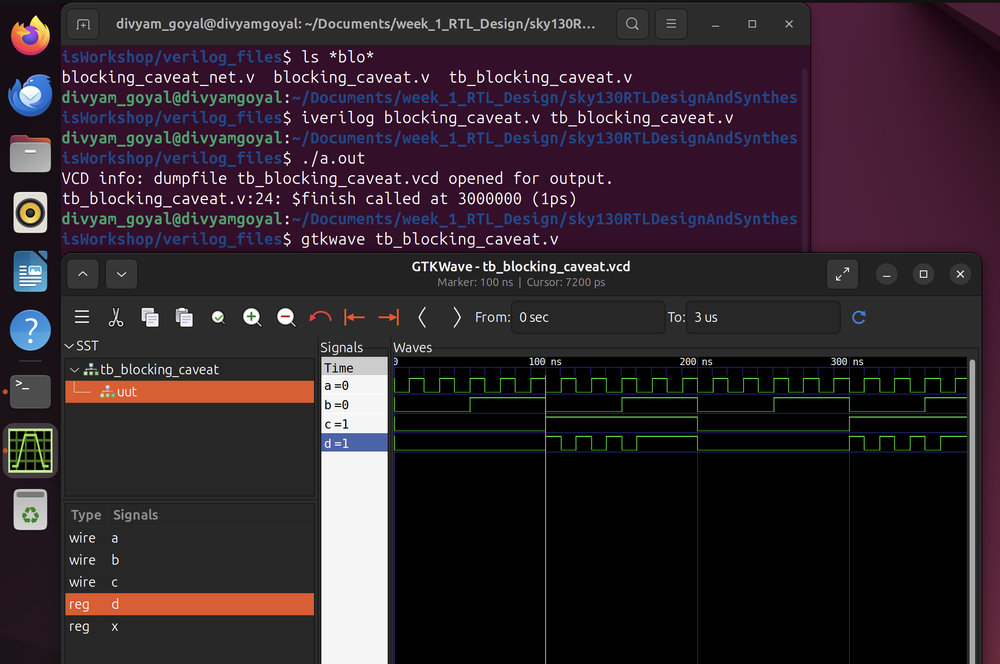
</div>

After this synthesise the netlist using yosys 

---
## GLS of blocking_caveat design

```bash
iverilog ../my_lib/verilog_model/primitives.v  ../my_lib/verilog_model/sky130_fd_sc_hd.v blocking_caveat_netlist.v tb_blocking_caveat.v
./a.out
gtkwave tb_blocking_caveat.vcd
```
<div align="center">
  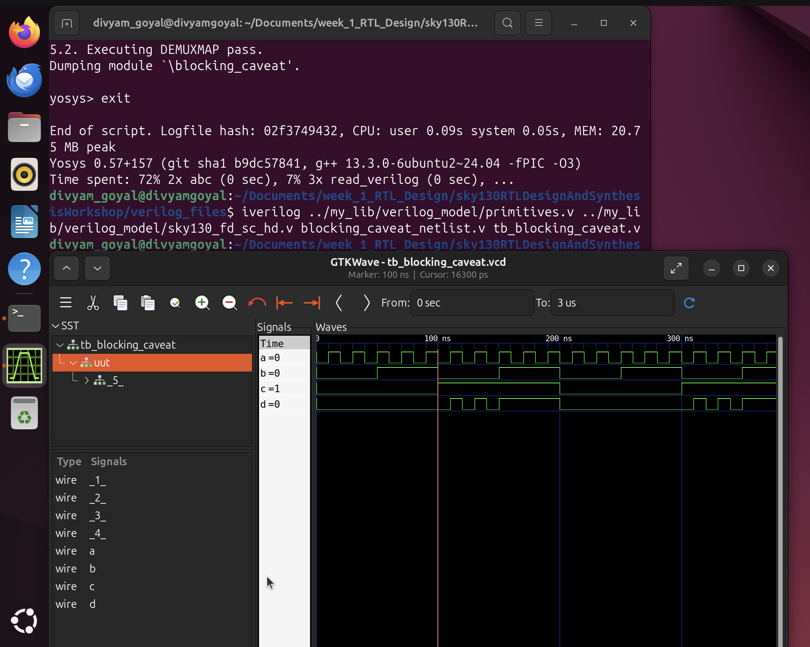
</div>

In this case, there is a mismatch in the simulation results between pre and post-synthesis due to the use of blocking assignments.
